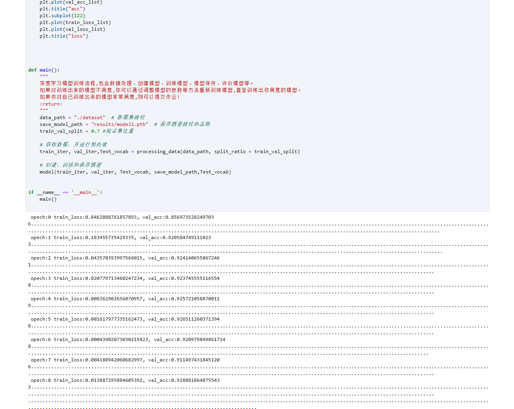
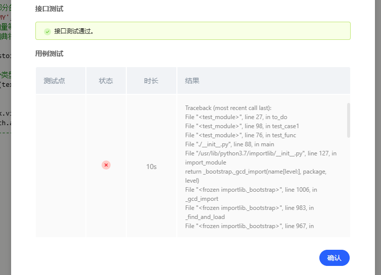
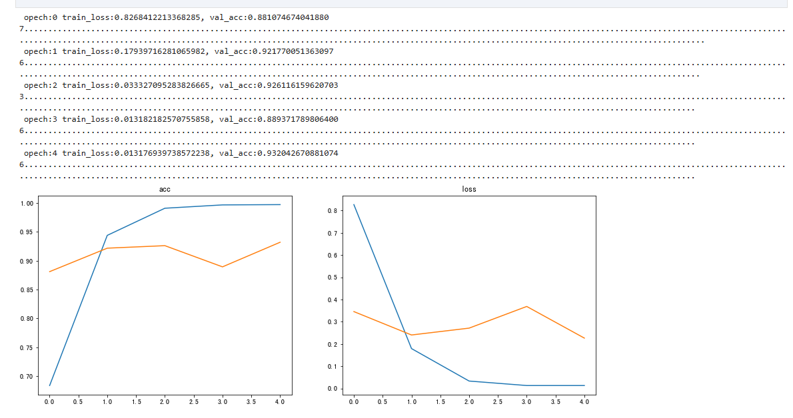
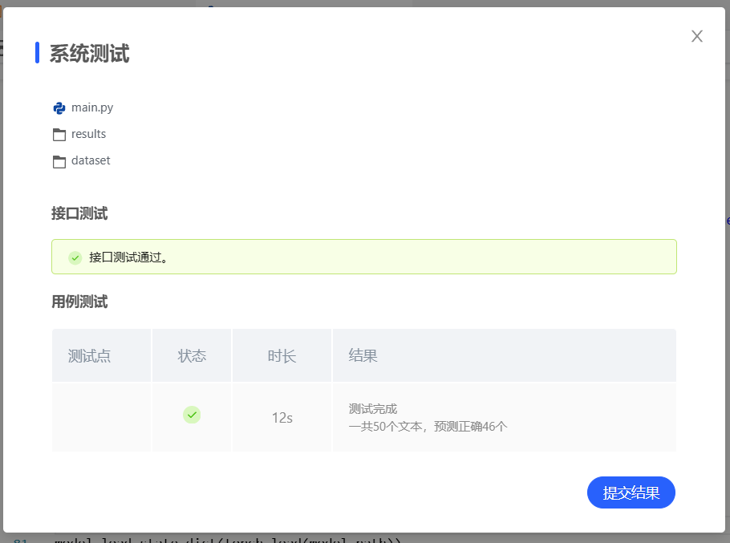

# 作家风格识别

## 1 实验介绍

### 1.1 实验背景

作家风格是作家在作品中表现出来的独特的审美风貌。通过分析作品的写作风格来识别作者这一研究有很多应用，比如可以帮助人们鉴定某些存在争议的文学作品的作者、判断文章是否剽窃他人作品等。

作者识别其实就是一个文本分类的过程，文本分类就是在给定的分类体系下，根据文本的内容自动地确定文本所关联的类别。 写作风格学就是通过统计的方法来分析作者的写作风格，作者的写作风格是其在语言文字表达活动中的个人言语特征，是人格在语言活动中的某种体现。

### 1.2 实验要求

a）建立深度神经网络模型，对文本信息进行检测识别出该文本对应的作者。
b）绘制深度神经网络模型图、绘制并分析学习曲线。
c）用准确率等指标对模型进行评估。

### 1.3 实验环境

可以使用基于 Python 分词库进行文本分词处理，使用 Numpy 库进行相关数值运算，使用 Keras 等框架建立深度学习模型等。

### 1.4 参考资料

- [jieba](https://github.com/fxsjy/jieba)
- [Numpy](https://www.numpy.org/)
- [Pytorch](https://pytorch.org/docs/stable/index.html)
- [TorchText](https://torchtext.readthedocs.io/en/latest/)

## 2 实验内容

### 2.1 介绍数据集

该数据集包含了 8438 个经典中国文学作品片段，对应文件分别以作家姓名的首字母大写命名。

数据集中的作品片段分别取自 5 位作家的经典作品，分别是：

| 序号 | 中文名 | 英文名 | 文本片段个数 |
| ---- | ------ | ------ | ------------ |
| 1    | 鲁迅   | LX     | 1500 条      |
| 2    | 莫言   | MY     | 2219 条      |
| 3    | 钱钟书 | QZS    | 1419 条      |
| 4    | 王小波 | WXB    | 1300 条      |
| 5    | 张爱玲 | ZAL    | 2000 条      |

- 其中截取的片段长度在 $100\sim 200$ 个中文字符不等
- 数据集路径为 `dataset/` 以作者名字首字母缩写命名

### 2.2 数据集预处理

在做文本挖掘的时候，首先要做的预处理就是分词。
英文单词天然有空格隔开容易按照空格分词，但是也有时候需要把多个单词做为一个分词，比如一些名词如 "New York" ，需要做为一个词看待。
而中文由于没有空格，分词就是一个需要专门去解决的问题了。
这里我们使用 jieba 包进行分词，使用**精确模式**、**全模式**和**搜索引擎模式**进行分词对比。

```python
# 精确模式分词
titles = [".".join(jb.cut(t, cut_all=False)) for t,_ in dataset.items()]
print("精确模式分词结果:\n",titles[0])
# 全模式分词
titles = [".".join(jb.cut(t, cut_all=True)) for t,_ in dataset.items()]
print("全模式分词结果:\n",titles[0])
# 搜索引擎模式分词
titles = [".".join(jb.cut_for_search(t)) for t,_ in dataset.items()]
print("搜索引擎模式分词结果:\n",titles[0])
```

```
精确模式分词结果:
 几个.少年.辛苦.奔走.了.十多年.，.暗地里.一颗.弹丸.要.了.他.的.性命.；.几个.少年.一击.不.中.，.在.监牢.里.身受.一个多月.的.苦刑.；.几个.少年.怀着.远志.，.忽然.踪影.全无.，.连.尸首.也.不知.那里.去.了.。.—.—.“.他们.都.在.社会.的.冷笑.恶骂.迫害.倾陷.里.过.了.一生.；.现在.他们.的.坟墓.也.早.在.忘却.里.渐渐.平.塌下去.了.。.

全模式分词结果:
 几个.少年.辛苦.奔走.了.十多.十多年.多年.，.暗地.暗地里.地里.一颗.弹丸.要.了.他.的.性命.；.几个.少年.一.击.不中.，.在.监牢.里.身受.一个.一个多.一个多月.多月.的.苦刑.；.几个.少年.怀着.远志.，.忽然.踪影.全.无.，.连.尸首.也.不知.那里.去.了.。——“.他们.都.在.社会.的.冷笑.恶骂.迫害.倾陷.里.过.了.一生.；.现在.他们.的.坟墓.也.早在.忘却.里.渐渐.平.塌下.塌下去.下去.了.。.
.
搜索引擎模式分词结果:
 几个.少年.辛苦.奔走.了.十多.多年.十多年.，.暗地.地里.暗地里.一颗.弹丸.要.了.他.的.性命.；.几个.少年.一击.不.中.，.在.监牢.里.身受.一个.多月.一个多.一个多月.的.苦刑.；.几个.少年.怀着.远志.，.忽然.踪影.全无.，.连.尸首.也.不知.那里.去.了.。.—.—.“.他们.都.在.社会.的.冷笑.恶骂.迫害.倾陷.里.过.了.一生.；.现在.他们.的.坟墓.也.早.在.忘却.里.渐渐.平.塌下.下去.塌下去.了.。.
```

使用 TF-IDF 算法统计各个作品的关键词频率：TF-IDF（term frequency–inverse document frequency，词频-逆向文件频率）是一种用于信息检索与文本挖掘的常用加权技术。

- TF-IDF是一种统计方法，用以评估一字词对于一个文件集或一个语料库中的其中一份文件的重要程度。
  字词的重要性随着它在文件中出现的次数成正比增加，但同时会随着它在语料库中出现的频率成反比下降。
- TF-IDF的主要思想是：如果某个单词在一篇文章中出现的频率TF高，并且在其他文章中很少出现，则认为此词或者短语具有很好的类别区分能力，适合用来分类。
  这里我们使用 jieba 中的默认语料库来进行关键词抽取，并展示鲁迅的前 5 个关键词，输出结果为：

```python
LX :
阿Q 0.05379690966906414
没有 0.03501956188388567
一个 0.02659384736489112
知道 0.026370791166196325
什么 0.026117200927953624
```

```python
  # BucketIterator可以针对文本长度产生batch，有利于训练
    train_iter, val_iter = BucketIterator.splits(
        (train,val), # 数据集
        batch_sizes=(16, 16),
        device=torch.device("cuda:0") if torch.cuda.is_available() else torch.device("cpu"), 
        sort_key=lambda x: len(x.text),
        sort_within_batch=False,
        repeat=False #
    )
```

### 2.3 模型训练

对于自然语言任务，比较好的选择是RNN和Transformer.这里我们使用 RNN 进行训练，使用 Pytorch 库进行模型构建。

模型、优化器、损失函数的选择：

```python
    device = torch.device("cuda:1") if torch.cuda.is_available() else torch.device("cpu")
    model = RNN(Text_vocab).to(device)
    epochs = 5
    loss_fn = nn.CrossEntropyLoss()
    optimizer = torch.optim.Adam(model.parameters())
    best_model_weights = copy.deepcopy(model.state_dict())
```

### 2.4结果展示

#### 2.4.1 epochs = 10

这里对RNN进行训练，初始设置epochs=10,发现训练到8个epoch时，准确率没有明显上升，为避免过拟合手动停止了训练。结果如下：



结果在系统测试时出现报错，经排查发现是main.py的模型忘记修改，修改main.py后调整epochs = 5再次训练



#### 2.4.2 epochs = 5

调整epochs = 5后，训练结果如下：



可以看出随着训练损失函数在逐渐下降，准确率也在逐渐上升。
系统测试结果如下，50个文本正确43个，准确率86%。：


#### 2.4.3 尝试调整参数多次训练寻找更好结果

- epochs = 8,split_ratio = 0.7：正确率达到46/50，保存在acc_model1.pth,结果如下：



- epochs = 6,split_ratio = 0.7,改变模型的结构，embedding_dim=512，正确率达到47/50，保存在acc_model2.pth,结果如下：


- epochs = 6,split_ratio = 0.8,embedding_dim=512，正确率达到48/50，保存在loss_model3.pth,结果如下：


## 3 心得体会

本实验重点考察对模型的选择和对模型训练过程的理解，相对来说没有对参数选取过多要求。经过本次实验，我熟悉掌握了pytorch的使用方法，对深度学习模型的构建、训练、测试有了更深入的理解。
在训练过程中，我们关注了损失函数的下降和准确率的提升。通过调整epochs数量，我们发现在一定epoch后，模型的性能不再显著提升，这可能是由于模型开始过拟合。因此，合理设置训练轮次对于避免过拟合并提高模型泛化能力至关重要。
同时，合理选择训练集和验证集的划分大小，可以有效提升模型的准确度和泛化能力。

## 4 代码展示

模型训练代码train.py：

```python
# 导入相关包
import copy
import os
import random
import numpy as np
import jieba as jb
import jieba.analyse
import matplotlib.pyplot as plt

import torch
import torch.nn as nn
from torch.nn import init
import torch.nn.functional as f
from torchtext import data
from torchtext import datasets
from torchtext.data import Field
from torchtext.data import Dataset
from torchtext.data import Iterator
from torchtext.data import Example
from torchtext.data import BucketIterator

class RNN(nn.Module):
    def __init__(self,Text_vocab):
        super(RNN, self).__init__()
        self.emb = nn.Embedding(num_embeddings=len(Text_vocab), embedding_dim=512)
        self.lstm = torch.nn.LSTM(512, 128, bidirectional=True, dropout=0.2, batch_first=True)
        self.fc1 = nn.Linear(256, 5)
        self.fc2 = nn.Linear(128, 5)
        self.drop = nn.Dropout(0.1)

    def forward(self, x):
        x = self.emb(x).permute(1, 0, 2)
        output, hidden = self.lstm(x)
        # print(hidden[0].shape)
        # x = output[:, 0, :]
        x = output.mean(1)
        x = self.fc1(x)
        # x = self.fc2(x)
        out = x
        return out

def processing_data(data_path, split_ratio = 0.7):
    """
    数据处理
    :data_path：数据集路径
    :validation_split：划分为验证集的比重
    :return：train_iter,val_iter,TEXT.vocab 训练集、验证集和词典
    """
    # --------------- 已经实现好数据的读取，返回和训练集、验证集，可以根据需要自行修改函数 ------------------
    sentences = [] # 片段
    target = [] # 作者

    # 定义lebel到数字的映射关系
    labels = {'LX': 0, 'MY': 1, 'QZS': 2, 'WXB': 3, 'ZAL': 4}

    files = os.listdir(data_path)
    for file in files:
        if not os.path.isdir(file):
            f = open(data_path + "/" + file, 'r', encoding='UTF-8');  # 打开文件
            for index,line in enumerate(f.readlines()):
                sentences.append(line)
                target.append(labels[file[:-4]])

    mydata = list(zip(sentences, target))

    TEXT  = Field(sequential=True, tokenize=lambda x: jb.lcut(x),
                       lower=True, use_vocab=True)
    LABEL = Field(sequential=False, use_vocab=False)

    FIELDS = [('text', TEXT), ('category', LABEL)]

    examples = list(map(lambda x: Example.fromlist(list(x), fields=FIELDS),
                                     mydata))

    dataset = Dataset(examples, fields=FIELDS)

    TEXT.build_vocab(dataset)

    train, val = dataset.split(split_ratio=split_ratio)

    # BucketIterator可以针对文本长度产生batch，有利于训练
    train_iter, val_iter = BucketIterator.splits(
        (train,val), # 数据集
        batch_sizes=(16, 16),
        device=torch.device("cuda:0") if torch.cuda.is_available() else torch.device("cpu"), 
        sort_key=lambda x: len(x.text),
        sort_within_batch=False,
        repeat=False #
    )
    # --------------------------------------------------------------------------------------------
    return train_iter,val_iter,TEXT.vocab

def model(train_iter, val_iter, Text_vocab,save_model_path,TEXT_vocab,epochs):
    """
    创建、训练和保存深度学习模型

    """

    # 创建模型实例
    # 创建模型实例
    device = torch.device("cuda:1") if torch.cuda.is_available() else torch.device("cpu")
    model = RNN(Text_vocab).to(device)
    loss_fn = nn.CrossEntropyLoss()
    optimizer = torch.optim.Adam(model.parameters())
    best_model_weights = copy.deepcopy(model.state_dict())
    train_acc_list, train_loss_list = [], []
    val_acc_list, val_loss_list = [], []
    best_loss = 1e9
    best_acc = 0
        
    for epoch in range(epochs):
        model.train()
        train_acc, train_loss = 0, 0
        val_acc, val_loss = 0, 0
        
        for idx, batch in enumerate(train_iter):
            text, label = batch.text, batch.category
            optimizer.zero_grad()
            out = model(text)
#             print("Output shape:", out.shape)  # 输出模型的形状
#             print("Label shape:", label.shape)  # 输出标签的形状
#             print(".",end = '') #设置简单训练进度条
            loss = loss_fn(out,label.long())
            loss.backward( retain_graph=True)
            optimizer.step()
            accracy = np.mean((torch.argmax(out,1)==label).cpu().numpy())
            # 计算每个样本的acc和loss之和
            train_acc += accracy*len(batch)
            train_loss += loss.item()*len(batch)


        model.eval()
        # 在验证集上预测
        with torch.no_grad():
            for idx, batch in enumerate(val_iter):
                text, label = batch.text, batch.category
                out = model(text)
                loss = loss_fn(out,label.long())
                accracy = np.mean((torch.argmax(out,1)==label).cpu().numpy())
                # 计算一个batch内每个样本的acc和loss之和
                val_acc += accracy*len(batch)
                val_loss += loss.item()*len(batch)

        train_acc /= len(train_iter.dataset)
        train_loss /= len(train_iter.dataset)
        val_acc /= len(val_iter.dataset)
        val_loss /= len(val_iter.dataset)
        train_acc_list.append(train_acc)
        train_loss_list.append(train_loss)
        val_acc_list.append(val_acc)
        val_loss_list.append(val_loss)
        
        print("\r opech:{} train_loss:{}, val_acc:{}".format(epoch,train_loss,val_acc,end=" "))


        # 保存模型
        if train_loss < best_loss:
            best_model_weights = copy.deepcopy(model.state_dict())
            best_loss = train_loss
            torch.save(best_model_weights, './results/loss_model4.pth')

        if val_acc >= best_acc:
            best_model_weights = copy.deepcopy(model.state_dict())
            best_acc = val_acc
            torch.save(best_model_weights, './results/acc_model4.pth')
        
        # 绘制曲线
    plt.figure(figsize=(15,5.5))
    plt.subplot(121)
    plt.plot(train_acc_list)
    plt.plot(val_acc_list)
    plt.title("acc")
    plt.subplot(122)
    plt.plot(train_loss_list)
    plt.plot(val_loss_list)
    plt.title("loss")


def main():
    """
    深度学习模型训练流程,包含数据处理、创建模型、训练模型、模型保存、评价模型等。
    如果对训练出来的模型不满意,你可以通过调整模型的参数等方法重新训练模型,直至训练出你满意的模型。
    如果你对自己训练出来的模型非常满意,则可以提交作业!
    :return:
    """
    data_path = "./dataset"  # 数据集路径
    save_model_path = "results/model1.pth"  # 保存模型路径和名称(yiqiqyong)
    train_val_split = 0.8 #验证集比重
    epochs = 10

    # 获取数据、并进行预处理
    train_iter, val_iter,Text_vocab = processing_data(data_path, split_ratio = train_val_split)

    # 创建、训练和保存模型
    model(train_iter, val_iter, Text_vocab, save_model_path,Text_vocab,epochs)


if __name__ == '__main__':
    main()

```

文本预测代码main.py：

```python
import copy
import os
import random
import numpy as np
import jieba as jb
import jieba.analyse
import matplotlib.pyplot as plt

import torch
import torch.nn as nn
from torch.nn import init
import torch.nn.functional as f
from torchtext import data
from torchtext import datasets
from torchtext.data import Field
from torchtext.data import Dataset
from torchtext.data import Iterator
from torchtext.data import Example
from torchtext.data import BucketIterator

class RNN(nn.Module):
    def __init__(self,Text_vocab):
        super(RNN, self).__init__()
        self.emb = nn.Embedding(num_embeddings=len(Text_vocab), embedding_dim=300)
        self.lstm = torch.nn.LSTM(300, 128, bidirectional=True, dropout=0.2, batch_first=True)
        self.fc1 = nn.Linear(256, 5)
        self.fc2 = nn.Linear(128, 5)
        self.drop = nn.Dropout(0.1)

    def forward(self, x):
        x = self.emb(x).permute(1, 0, 2)
        output, hidden = self.lstm(x)
        # print(hidden[0].shape)
        # x = output[:, 0, :]
        x = output.mean(1)
        x = self.fc1(x)
        # x = self.fc2(x)
        out = x
        return out

def load_data(path):
    """
    读取数据和标签
    :param path:数据集文件夹路径
    :return:返回读取的片段和对应的标签
    """
    sentences = [] # 片段
    target = [] # 作者

    # 定义lebel到数字的映射关系
    labels = {'LX': 0, 'MY': 1, 'QZS': 2, 'WXB': 3, 'ZAL': 4}

    files = os.listdir(path)
    for file in files:
        if not os.path.isdir(file):
            f = open(path + "/" + file, 'r', encoding='UTF-8');  # 打开文件
            for index,line in enumerate(f.readlines()):
                sentences.append(line)
                target.append(labels[file[:-4]])

    return list(zip(sentences, target))

# 定义Field
TEXT  = Field(sequential=True, tokenize=lambda x: jb.lcut(x), lower=True, use_vocab=True)
LABEL = Field(sequential=False, use_vocab=False)
FIELDS = [('text', TEXT), ('category', LABEL)]

# 读取数据，是由tuple组成的列表形式
mydata = load_data(path='dataset/')

# 使用Example构建Dataset
examples = list(map(lambda x: Example.fromlist(list(x), fields=FIELDS), mydata))
dataset = Dataset(examples, fields=FIELDS)
# 构建中文词汇表
TEXT.build_vocab(dataset)


# 创建模型实例
model = RNN(TEXT.vocab)
model_path ="results/loss_model1.pth" 
model.load_state_dict(torch.load(model_path))

# -------------------------请勿修改 predict 函数的输入和输出-------------------------
def predict(text):
    """
    :param text: 中文字符串
    :return: 字符串格式的作者名缩写
    """
     # ----------- 实现预测部分的代码，以下样例可代码自行删除，实现自己的处理方式 -----------
    labels = {0: 'LX', 1: 'MY', 2: 'QZS', 3: 'WXB', 4: 'ZAL'}
    # 自行实现构建词汇表、词向量等操作
    # 将句子做分词，然后使用词典将词语映射到他的编号

    text2idx = [TEXT.vocab.stoi[i] for i in jb.lcut(text) ]

    # 转化为Torch接收的Tensor类型
    text2idx = torch.Tensor(text2idx).long()

    # 模型预测部分
    results = model(text2idx.view(-1,1))
    prediction = labels[torch.argmax(results,1).numpy()[0]]
    # --------------------------------------------------------------------------

    return prediction
```
