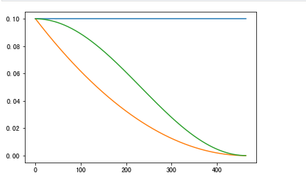
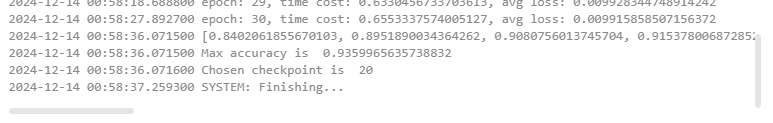
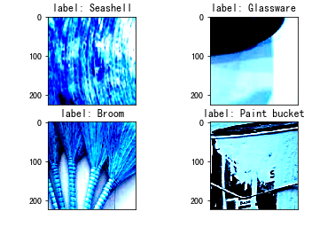
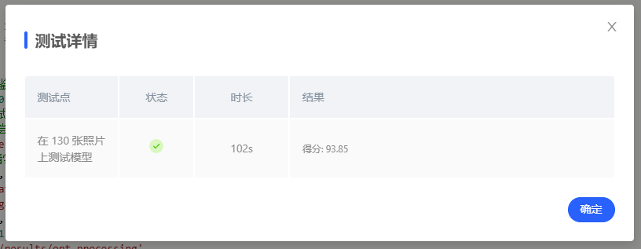
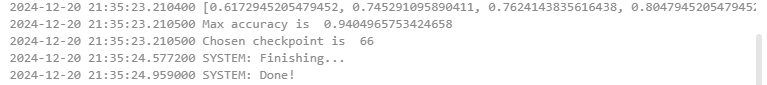
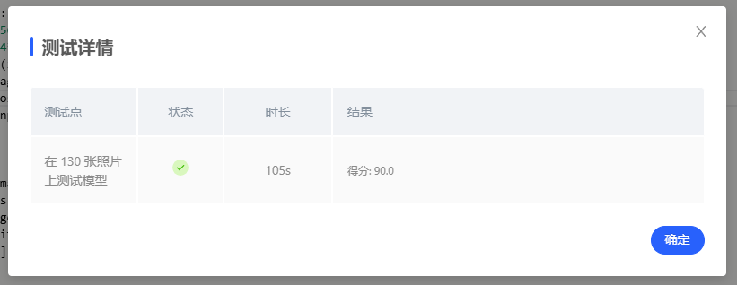
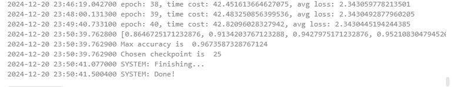
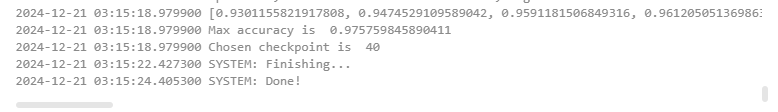

# 基于Mobilenetv2的垃圾分类

|姓名|学号|
|----|----|
|赵伟|3220102070|

## 参考了这位宗威旭学长的思路，在此基础上进行了修改：
[宗学长这个项目的GitHub](https://github.com/ZoRax-A5/AI_Course/blob/7920962cfc61a90bcaa473c50ac4b13f9949b91a/MobileNet2/report.md?plain=1#L5)

## 一、问题重述

题目要求基于 MindSpore 开发框架，掌握 MindSpore 框架的基本搭建过程，基于 MobileNetV2 实现一个垃圾分类模型，并提高其验证精度。

## 二、设计思想

垃圾分类模型基于 MobileNetv2 实现。我们主要利用 mindspore 提供的预训练模型进行 Fine-Tune。在训练过程中，结合 MobileNetv2 的层次结构，我们可以冻结网络的 backbone（用于特征提取），只训练网络的 Head 层。将特征提取得到的 feature map 作为训练 Head 的数据集，减少训练时间。

训练的微调过程中我们主要处理的超参有以下几个：

* learning rate, decay type
* momentum, weight decay (Momentum Optimizer)
* epochs
* other: batch size

针对学习率。模型在训练过程中趋于收敛，学习率应该是一个动态衰减的过程，减小训练后期的抖动。项目实现的学习率下降策略有：`cosine decay` 和 `square decay`。两者的主要区别在于衰减的发生时期。前者（下图绿色）在后期逐渐衰减，而后者（下图橘色）在训练前期就有较大衰减，相对均匀。



针对优化器，项目中默认使用 `Momentum` 优化器，来加快梯度下降过程中模型的收敛速度。也可以尝试其他优化器：在 MindSpore 1.0 中支持的包括 SGD, Adam 等优化器。（该版本并不支持 Adagrad）

训练过程中，应该及时保存中间的模型。保存的 checkpoint 可选取精度高的模型进行预测。对于中间模型，也可以进一步作为预训练模型，应用于更细化的训练场景。

## 三、代码内容

定义训练过程中需要的上下文和超参，参数如下所示：

```python
# 训练超参
config = EasyDict({
    "num_classes": 26, # 分类数，即输出层的维度
    "reduction": 'mean', # mean, max, Head部分池化采用的方式
    "image_height": 224,
    "image_width": 224,
    "batch_size": 32, # 鉴于CPU容器性能，太大可能会导致训练卡住
    "eval_batch_size": 10,
    "epochs": 80, # 请尝试修改以提升精度
    "lr_max": 0.03, # 请尝试修改以提升精度
    "decay_type": 'cosine', # 请尝试修改以提升精度
    "momentum": 0.9, # 请尝试修改以提升精度
    "weight_decay": 4e-5, # 请尝试修改以提升精度
    "dataset_path": "./datasets/5fbdf571c06d3433df85ac65-momodel/garbage_26x100",
    "features_path": "./garbage_26x100_features", # 临时目录，保存冻结层Feature Map，可随时删除
    "class_index": index,
    "save_ckpt_epochs": 1,
    "save_ckpt_path": './results/opt_processing',
    "pretrained_ckpt": './src_mindspore/mobilenetv2-200_1067_cpu_gpu.ckpt',
    "export_path": './results/mobilenetv2.mindir'

})
```

实现学习率的动态变化，包含常数变化、平方衰减和余弦衰减。其余设置 warmup 和最终学习率。

```python
def build_lr(total_steps, lr_init=0.0, lr_end=0.0, lr_max=0.1, warmup_steps=0, decay_type='cosine'):
    lr_init, lr_end, lr_max = float(lr_init), float(lr_end), float(lr_max)
    decay_steps = total_steps - warmup_steps
    lr_all_steps = []
    inc_per_step = (lr_max - lr_init) / warmup_steps if warmup_steps else 0
    for i in range(total_steps):
        if i < warmup_steps:
            lr = lr_init + inc_per_step * (i + 1)
        else:
            if decay_type == 'cosine':
                cosine_decay = 0.5 * (1 + math.cos(math.pi * (i - warmup_steps) / decay_steps))
                lr = (lr_max - lr_end) * cosine_decay + lr_end
            elif decay_type == 'square':
                frac = 1.0 - float(i - warmup_steps) / (total_steps - warmup_steps)
                lr = (lr_max - lr_end) * (frac * frac) + lr_end
            else:
                lr = lr_max
        lr_all_steps.append(lr)

    return lr_all_steps
```

训练中冻结 backbone 层，只需要将该层提取的特征作为 Head 层的输入。该层提取 Feature Map 过程如下。并加载预训练模型。

```python
def extract_features(net, dataset_path, config):
    if not os.path.exists(config.features_path):
        os.makedirs(config.features_path)
    dataset = create_dataset(config=config)
    step_size = dataset.get_dataset_size()
    if step_size == 0:
        raise ValueError("The step_size of dataset is zero. Check if the images count of train dataset is more \
            than batch_size in config.py")

    data_iter = dataset.create_dict_iterator()
    for i, data in enumerate(data_iter):
        features_path = os.path.join(config.features_path, f"feature_{i}.npy")
        label_path = os.path.join(config.features_path, f"label_{i}.npy")
        if not os.path.exists(features_path) or not os.path.exists(label_path):
            image = data["image"]
            label = data["label"]
            features = net(image)
            np.save(features_path, features.asnumpy())
            np.save(label_path, label.asnumpy())
        print(f"Complete the batch {i+1}/{step_size}")
    return

backbone = MobileNetV2Backbone()
load_checkpoint(config.pretrained_ckpt, net=backbone)
extract_features(backbone, config.dataset_path, config)
```

下面是 Head 层的实现和训练。这里只放部分训练部分的实现。冻结backbone层

```python
backbone = MobileNetV2Backbone()
# Freeze parameters of backbone. You can comment these two lines.
for param in backbone.get_parameters():
    param.requires_grad = False
```

定义损失函数，优化器，并调用给对应网络

```python
loss = nn.SoftmaxCrossEntropyWithLogits(sparse=True, reduction='mean')
lrs = build_lr(config.epochs * step_size, lr_max=config.lr_max, warmup_steps=0, decay_type=config.decay_type)
opt = nn.Momentum(head.trainable_params(), lrs, config.momentum, config.weight_decay)
net = nn.WithLossCell(head, loss)
train_step = nn.TrainOneStepCell(net, opt)
train_step.set_train()
```

开展 epochs 次训练，记录每次训练时长以及 loss 值，并将中间训练结果进行保存。

```python
for epoch in range(config.epochs):
    random.shuffle(idx_list)
    epoch_start = time.time()
    losses = []
    for j in idx_list:
        feature = Tensor(np.load(os.path.join(features_path, f"feature_{j}.npy")))
        label = Tensor(np.load(os.path.join(features_path, f"label_{j}.npy")))
        losses.append(train_step(feature, label).asnumpy())
    epoch_seconds = (time.time() - epoch_start)
    epoch_loss = np.mean(np.array(losses))

    history.append(epoch_loss)
    print("epoch: {}, time cost: {}, avg loss: {}".format(epoch + 1, epoch_seconds, epoch_loss))
    if (epoch + 1) % config.save_ckpt_epochs == 0:
        save_checkpoint(network, os.path.join(config.save_ckpt_path, f"mobilenetv2-{epoch+1}.ckpt"))
```

可以每隔一个固定周期，在训练集上进行一次评估，实时跟踪中间训练模型在训练集上的准确率

```python
eval_model = Model(network, loss, metrics={'acc', 'loss'})
acc = eval_model.eval(eval_dataset, dataset_sink_mode=False)
```

最终做模型评估时，对于输入图像进行处理 (rescale)，并调用训练的模型进行预测：

```python
def image_process(image): 
    mean=[0.485*255, 0.456*255, 0.406*255]
    std=[0.229*255, 0.224*255, 0.225*255]
    image = (np.array(image) - mean) / std
    image = image.transpose((2,0,1))
    img_tensor = Tensor(np.array([image], np.float32))
    return img_tensor

def predict(image):
    image = cv2.resize(image,(config.image_height, config.image_width))
    image = image_process(image)
    
    logits = network(image)
    pred = np.argmax(logits.asnumpy(), axis=1)[0]
    
    return inverted[pred]
```

## 四、实验结果

### 垃圾分类

这里主要介绍调参的思路，以及最终的训练结果,经过不断调试，我们达到了几乎97%的准确率，系统测试分数达到96.92分。

初次直接运行题目中给定的默认参数，运行效果如下所示：

```python
config = EasyDict({
    "epochs": 10, # 请尝试修改以提升精度
    "lr_max": 0.01, # 请尝试修改以提升精度
    "decay_type": 'constant', # 请尝试修改以提升精度
    "momentum": 0.8, # 请尝试修改以提升精度
    "weight_decay": 3.0, # 请尝试修改以提升精度
})
```

| dataset            | loss  | accuracy |
| ------------------ | ----- | -------- |
| train (epoch = 10) | 2.528 | 0.514    |
| test               |       | 0.523    |

可以看到模型的正确率并不高。上面给定的参数并不适用：`epochs` 过小（针对上面的参数来说），会导致训练过程不充分。`learning rate` 是一个常数，我们可以选择不同的取值以及衰减函数，使学习率动态变化。`momentum` 取值可以进一步增大，例如 0.9，0.99来加速收敛。`weight_decay` 设置的过大，很难在一个最低点稳定下来，一般我们设置为 0 - 0.1的一个值。这一点应该根据学习率动态调整。

基于经验参数进行微调，首先思路是设置一个合适的 epochs 和较低的学习率。学习率动态下降采用 `cosine` 动态变化，让其学习率在训练前半部分下降较慢。这里的 weight_decay 还是比较大的，容易在训练后期产生较大的震荡，可以进一步调小，或改变学习率的 lr_end。过程中也对于学习率、momentum, weight_decay 进行微调。

随后我们选择的超参如下：

```python
config = EasyDict({
    "num_classes": 26, # 分类数，即输出层的维度
    "reduction": 'mean', # mean, max, Head部分池化采用的方式
    "image_height": 224,
    "image_width": 224,
    "batch_size": 24, # 鉴于CPU容器性能，太大可能会导致训练卡住
    "eval_batch_size": 10,
    "epochs": 40, # 请尝试修改以提升精度
    "lr_max": 0.03, # 请尝试修改以提升精度
    "decay_type": 'cosine', # 请尝试修改以提升精度
    "momentum": 0.9, # 请尝试修改以提升精度
    "weight_decay": 4e-5, # 请尝试修改以提升精度
    "dataset_path": "./datasets/5fbdf571c06d3433df85ac65-momodel/garbage_26x100",
    "features_path": "./results/garbage_26x100_features", # 临时目录，保存冻结层Feature Map，可随时删除
    "class_index": index,
    "save_ckpt_epochs": 1,
    "save_ckpt_path": './results/ckpt_mobilenetv2',
    "pretrained_ckpt": './src_mindspore/mobilenetv2-200_1067_cpu_gpu.ckpt',
    "export_path": './results/mobilenetv2.mindir'

})
```

随后进行训练和测试，验证集accuracy达到93.59%，训练集loss在0.01以下，系统测试得分为77.69分。




然后针对学习率，epochs，momentum，weight_decay 进行微调，得分始终在73-77之间波动，没有很高的分数。这样微调过十几次后，发现验证集的准确率在90以上，而测试只有70多的准确率，这显然是不合理的。随后在调试jupyter时发现**处理过的图片的香蕉皮和篮球是诡异的蓝色**，像下图：


经过调试发现了问题，在creart_dataset函数中，
```python
crop_decode_resize = C.RandomCropDecodeResize(resize_height, scale=(0.08, 1.0), ratio=(0.75, 1.333))
```
decoder默认会把图片的色彩空间转换为RGB，而在main.py里，PIL读取的图片默认是BGR，所以需要转换一下：
    
```python
image = cv2.cvtColor(image, cv2.COLOR_BGR2RGB)
```

在添加一步转换色彩空间的处理后，系统测试分数飙升到93.85。



### 随后才进入到了真正的沉浸式调参环节：

#### 1. 我选择了增加epochs，于是选取了epochs = 80，经过训练后选择的checkpoint为66/80，发现测试分数只有90分，可能是由于过大的epochs导致的学习到了训练集的特异化特征导致准确率有所下降，结果如下：




#### 2. 在队友那边的调试过程中，发现lr_max取0.02，decay_type取square，momentum取0.99、0.85,weight_decay取0.001、0.00005后，分数均没有提高。

#### 3. 同时我在修改creat_dataset函数中的repeat参数.这步操作是针对数据集处理，我们可以稍微调大 repeat 来扩充数据集的大小，这一点在项目中 `create_dataset` 提供了对应接口。查看 `create_dataset` 接口发现，函数使用 `c_transform` 做了一个数据增强，包括 `RandomCropDecodeResize`, `RandomHorizontalFlip`, `RandomColorAdjust`，对图片做一个位移、缩放、随机水平翻转和光照的相干性。因此，这里我做了一个 repeat 操作，扩充数据集，并增强上述的相干性。

| repeat            |epochs | accuracy  | score    |
| ------------------ | ----- |----- | -------- |
| 4               |36/40 | 92.92% | 92.31    |
| 8               |25/40|     96.74%  | 96.92    |




#### 4. 想在此基础上继续提高效果，我选择了更换优化器继续尝试，比较简单的，我将Momentum换成Adam优化器，并调节Adam的参数，最终结果如下：



checkpoint40的系统测试分数为94.62分，但是发现checkpoint36的系统测试分数为95.38分，这说明模型可能在测试集上有类似于过拟合的现象，我便逐一排查checkpoint，排查到中途发现这样的做法很没意义，不能稳定到100%的准确率，然后通过这样的方法追求那一两分的系统分数实在是没必要，而且97%的准确率已经足够应用到很多场景了。
**最重要的是，更换Adam优化器后，验证集的准确率accuracy达到97.6%，远远高于上一次的结果，这说明模型的优化器选择对结果的影响很大，我们的优化方向也没有问题，只是受测试数据集的随机性影响导致分数没有提高，预期经过多次训练后是可以达到一个更高的测试分数的。**


#### 5. 最终调参优化

最后又经过了几十次的调参尝试，我们发现很难再能够提高准确率，同时97%的准确率在某种程度上已经足够了（数据集，模型复杂度，GPU等等多种限制）。因此，我们选择了最优的超参，并将其保存到 './results/opt_processing/mobilenetv2-25.ckpt' 文件中。

## 五、总结

本项目主要介绍了如何使用MindSpore实现垃圾分类与数字识别的任务，并通过调参的方式，最终达到了97%的准确率。通过本项目，我们可以了解到MindSpore的基本使用方法，以及如何使用MobileNetV2进行图像分类任务。

相对于前面的项目，本项目的难点根本不在于调参，因为训练时间长，调参效率有限。而在于如何处理数据集、如何处理图像数据，或者说如何发现在训练模型过程中的问题来源，以及对模型的改进方向的思考、认识到各个模块的作用、熟悉数据集生成过程、模型的搭建与训练过程以及debug的能力。

主要占用时间的是后面提高模型准确率的过程。慢慢尝试占用了 10h 的 GPU 运行时间。从这一过程感觉 mindspore 设计的接口还是蛮灵活的。在数据集创建过程，可以经过 shuffle, map, batch, repeat 一系列操作，并在 map 过程中可以进行数据强化。通过调节常用的训练参数，对于这些参数的经验取值有了更深的理解。最大的收获还是对于如何从训练集、测试集的评估结果反馈到参数调整上，以及对于优化模型的整体过程和切入点有了更好的思路。

最后，虽然MindSpore具有易用性、灵活性、可扩展性、可移植性等优点，使其在工业界得到广泛应用，但对于初学者来说，就我个人的学习体验上来讲，远远不如pytorch。

## 代码展示 

### train_main.py

```python
import math
import numpy as np
import os
import cv2
import random
import shutil
import time
from matplotlib import pyplot as plt
from easydict import EasyDict
from PIL import Image

import mindspore as ms
from mindspore import context
from mindspore import nn
from mindspore import Tensor
from mindspore.train.model import Model
from mindspore.train.serialization import load_checkpoint, save_checkpoint, export
from mindspore.train.callback import Callback, LossMonitor, ModelCheckpoint, CheckpointConfig


from src_mindspore.dataset import create_dataset # 数据处理脚本
from src_mindspore.mobilenetv2 import MobileNetV2Backbone, MobileNetV2Head, mobilenet_v2 # 模型定义脚本

os.environ['GLOG_v'] = '2' # Log Level = Error
has_gpu = (os.system('command -v nvidia-smi') == 0)
print('Excuting with', 'GPU' if has_gpu else 'CPU', '.')
context.set_context(mode=context.GRAPH_MODE, device_target='GPU' if has_gpu else 'CPU')

# 垃圾分类数据集标签，以及用于标签映射的字典。
index = {'00_00': 0, '00_01': 1, '00_02': 2, '00_03': 3, '00_04': 4, '00_05': 5, '00_06': 6, '00_07': 7,
         '00_08': 8, '00_09': 9, '01_00': 10, '01_01': 11, '01_02': 12, '01_03': 13, '01_04': 14,
         '01_05': 15, '01_06': 16, '01_07': 17, '02_00': 18, '02_01': 19, '02_02': 20, '02_03': 21,
         '03_00': 22, '03_01': 23, '03_02': 24, '03_03': 25}
inverted = {0: 'Plastic Bottle', 1: 'Hats', 2: 'Newspaper', 3: 'Cans', 4: 'Glassware', 5: 'Glass Bottle', 6: 'Cardboard', 7: 'Basketball',
            8: 'Paper', 9: 'Metalware', 10: 'Disposable Chopsticks', 11: 'Lighter', 12: 'Broom', 13: 'Old Mirror', 14: 'Toothbrush',
            15: 'Dirty Cloth', 16: 'Seashell', 17: 'Ceramic Bowl', 18: 'Paint bucket', 19: 'Battery', 20: 'Fluorescent lamp', 21: 'Tablet capsules',
            22: 'Orange Peel', 23: 'Vegetable Leaf', 24: 'Eggshell', 25: 'Banana Peel'}

# 训练超参
config = EasyDict({
    "num_classes": 26, # 分类数，即输出层的维度
    "reduction": 'mean', # mean, max, Head部分池化采用的方式
    "image_height": 224,
    "image_width": 224,
    "batch_size": 32, # 鉴于CPU容器性能，太大可能会导致训练卡住
    "eval_batch_size": 10,
    "epochs": 40, # 请尝试修改以提升精度
    "lr_max": 0.03, # 请尝试修改以提升精度
    "decay_type": 'cosine', # 请尝试修改以提升精度
    "momentum": 0.9, # 请尝试修改以提升精度
    "weight_decay": 4e-5, # 请尝试修改以提升精度
    "dataset_path": "./datasets/5fbdf571c06d3433df85ac65-momodel/garbage_26x100",
    "features_path": "./garbage_26x100_features", # 临时目录，保存冻结层Feature Map，可随时删除
    "class_index": index,
    "save_ckpt_epochs": 1,
    "save_ckpt_path": './results/opt_processing',
    "pretrained_ckpt": './src_mindspore/mobilenetv2-200_1067_cpu_gpu.ckpt',
    "export_path": './results/mobilenetv2.mindir'

})

def build_lr(total_steps, lr_init=0.0, lr_end=0.0, lr_max=0.1, warmup_steps=0, decay_type='cosine'):
    """
    Applies cosine decay to generate learning rate array.

    Args:
       total_steps(int): all steps in training.
       lr_init(float): init learning rate.
       lr_end(float): end learning rate
       lr_max(float): max learning rate.
       warmup_steps(int): all steps in warmup epochs.

    Returns:
       list, learning rate array.
    """
    lr_init, lr_end, lr_max = float(lr_init), float(lr_end), float(lr_max)
    decay_steps = total_steps - warmup_steps
    lr_all_steps = []
    inc_per_step = (lr_max - lr_init) / warmup_steps if warmup_steps else 0
    for i in range(total_steps):
        if i < warmup_steps:
            lr = lr_init + inc_per_step * (i + 1)
        else:
            if decay_type == 'cosine':
                cosine_decay = 0.5 * (1 + math.cos(math.pi * (i - warmup_steps) / decay_steps))
                lr = (lr_max - lr_end) * cosine_decay + lr_end
            elif decay_type == 'square':
                frac = 1.0 - float(i - warmup_steps) / (total_steps - warmup_steps)
                lr = (lr_max - lr_end) * (frac * frac) + lr_end
            else:
                lr = lr_max
        lr_all_steps.append(lr)

    return lr_all_steps


def extract_features(net, dataset_path, config):
    if not os.path.exists(config.features_path):
        os.makedirs(config.features_path)
    dataset = create_dataset(config=config)
    step_size = dataset.get_dataset_size()
    if step_size == 0:
        raise ValueError("The step_size of dataset is zero. Check if the images count of train dataset is more \
            than batch_size in config.py")

    data_iter = dataset.create_dict_iterator()
    for i, data in enumerate(data_iter):
        features_path = os.path.join(config.features_path, f"feature_{i}.npy")
        label_path = os.path.join(config.features_path, f"label_{i}.npy")
        if not os.path.exists(features_path) or not os.path.exists(label_path):
            image = data["image"]
            label = data["label"]
            features = net(image)
            np.save(features_path, features.asnumpy())
            np.save(label_path, label.asnumpy())
        print(f"Complete the batch {i+1}/{step_size}")
    return

backbone = MobileNetV2Backbone()
load_checkpoint(config.pretrained_ckpt, net=backbone)
extract_features(backbone, config.dataset_path, config)
# backbone = MobileNetV2Backbone()
# load_checkpoint(config.pretrained_ckpt, net=backbone)
# extract_features(backbone, config.dataset_path, config)
class GlobalPooling(nn.Cell):
    """
    Global avg pooling definition.

    Args:
        reduction: mean or max, which means AvgPooling or MaxpPooling.

    Returns:
        Tensor, output tensor.

    Examples:
        >>> GlobalAvgPooling()
    """

    def __init__(self, reduction='mean'):
        super(GlobalPooling, self).__init__()
        if reduction == 'max':
            self.mean = ms.ops.ReduceMax(keep_dims=False)
        else:
            self.mean = ms.ops.ReduceMean(keep_dims=False)

    def construct(self, x):
        x = self.mean(x, (2, 3))
        return x


class MobileNetV2Head(nn.Cell):
    """
    MobileNetV2Head architecture.

    Args:
        input_channel (int): Number of channels of input.
        hw (int): Height and width of input, 7 for MobileNetV2Backbone with image(224, 224).
        num_classes (int): Number of classes. Default is 1000.
        reduction: mean or max, which means AvgPooling or MaxpPooling.
        activation: Activation function for output logits.
    Returns:
        Tensor, output tensor.

    Examples:
        >>> MobileNetV2Head(num_classes=1000)
    """

    def __init__(self, input_channel=1280, hw=7, num_classes=1000, reduction='mean', activation="Softmax"):
        self.need_activation = True
        super(MobileNetV2Head, self).__init__()
        if reduction:
            self.flatten = GlobalPooling(reduction)
        else:
            self.flatten = nn.Flatten()
            input_channel = input_channel * hw * hw
        self.dense = nn.Dense(input_channel, num_classes, weight_init='ones', has_bias=False)
        if activation == "Sigmoid":
            self.activation = nn.Sigmoid()
        elif activation == "Softmax":
            self.activation = nn.Softmax()
        else:
            self.need_activation = False

    def construct(self, x):
        x = self.flatten(x)
        x = self.dense(x)
        if self.need_activation:
            x = self.activation(x)
        return x

def train_head():
    train_dataset = create_dataset(config=config)
    eval_dataset = create_dataset(config=config)
    step_size = train_dataset.get_dataset_size()

    backbone = MobileNetV2Backbone()
    # Freeze parameters of backbone. You can comment these two lines.
    for param in backbone.get_parameters():
       param.requires_grad = False
    load_checkpoint(config.pretrained_ckpt, net=backbone)

    head = MobileNetV2Head(input_channel=backbone.out_channels, num_classes=config.num_classes, reduction=config.reduction)
    network = mobilenet_v2(backbone, head)

    loss = nn.SoftmaxCrossEntropyWithLogits(sparse=True, reduction='mean')
    lrs = build_lr(config.epochs * step_size, lr_max=config.lr_max, warmup_steps=0, decay_type=config.decay_type)
    opt = nn.Momentum(head.trainable_params(), lrs, config.momentum, config.weight_decay)
    net = nn.WithLossCell(head, loss)
    train_step = nn.TrainOneStepCell(net, opt)
    train_step.set_train()

    # train
    history = list()
    acc_list = []
    features_path = config.features_path
    idx_list = list(range(step_size))
    for epoch in range(config.epochs):
        random.shuffle(idx_list)
        epoch_start = time.time()
        losses = []
        for j in idx_list:
            feature = Tensor(np.load(os.path.join(features_path, f"feature_{j}.npy")))
            label = Tensor(np.load(os.path.join(features_path, f"label_{j}.npy")))
            losses.append(train_step(feature, label).asnumpy())
        epoch_seconds = (time.time() - epoch_start)
        epoch_loss = np.mean(np.array(losses))

        history.append(epoch_loss)
        print("epoch: {}, time cost: {}, avg loss: {}".format(epoch + 1, epoch_seconds, epoch_loss))
        if (epoch + 1) % config.save_ckpt_epochs == 0:
            save_checkpoint(network, os.path.join(config.save_ckpt_path, f"mobilenetv2-{epoch+1}.ckpt"))

        # evaluate
        # print('validating the model...')
        eval_model = Model(network, loss, metrics={'acc', 'loss'})
        acc = eval_model.eval(eval_dataset, dataset_sink_mode=False)
        acc_list.append(acc)
        # print(acc)

    return history,acc_list

#删除并重新创建文件夹
if os.path.exists(config.save_ckpt_path):
    shutil.rmtree(config.save_ckpt_path)
os.makedirs(config.save_ckpt_path)

#训练模型
history, acc_list= train_head()

# CKPT = f'mobilenetv2-{config.epochs}.ckpt'#会选择最后一个，不会选择最好的，需要修改
# print("Chosen checkpoint is", CKPT)
# print('training is ok!!!')

#选择验证集准确率最高的模型

# print(acc_list)
acc_values = [item['acc'] for item in acc_list]
CKPT = acc_values.index(max(acc_values))+1
print(acc_values)
print("Max accuracy is ",max(acc_values))
print("Chosen checkpoint is ", CKPT)

```

### main.py

```python
import os
import cv2
import numpy as np
import mindspore as ms
from PIL import Image
from mindspore import nn
from mindspore import Tensor
from easydict import EasyDict
from mindspore import context
from mindspore.train.serialization import load_checkpoint
from src_mindspore.mobilenetv2 import MobileNetV2Backbone, mobilenet_v2

os.environ['GLOG_v'] = '2'  # Log Level = Error
has_gpu = (os.system('command -v nvidia-smi') == 0)
print('Excuting with', 'GPU' if has_gpu else 'CPU', '.')
context.set_context(mode=context.GRAPH_MODE, device_target='GPU' if has_gpu else 'CPU')

# 垃圾分类数据集标签，以及用于标签映射的字典。
index = {'00_00': 0, '00_01': 1, '00_02': 2, '00_03': 3, '00_04': 4, '00_05': 5, '00_06': 6, '00_07': 7,
         '00_08': 8, '00_09': 9, '01_00': 10, '01_01': 11, '01_02': 12, '01_03': 13, '01_04': 14,
         '01_05': 15, '01_06': 16, '01_07': 17, '02_00': 18, '02_01': 19, '02_02': 20, '02_03': 21,
         '03_00': 22, '03_01': 23, '03_02': 24, '03_03': 25}
inverted = {0: 'Plastic Bottle', 1: 'Hats', 2: 'Newspaper', 3: 'Cans', 4: 'Glassware', 5: 'Glass Bottle', 6: 'Cardboard', 7: 'Basketball',
            8: 'Paper', 9: 'Metalware', 10: 'Disposable Chopsticks', 11: 'Lighter', 12: 'Broom', 13: 'Old Mirror', 14: 'Toothbrush',
            15: 'Dirty Cloth', 16: 'Seashell', 17: 'Ceramic Bowl', 18: 'Paint bucket', 19: 'Battery', 20: 'Fluorescent lamp', 21: 'Tablet capsules',
            22: 'Orange Peel', 23: 'Vegetable Leaf', 24: 'Eggshell', 25: 'Banana Peel'}


# 训练超参
config = EasyDict({
    "num_classes": 26,
    "reduction": 'mean',
    "image_height": 224,
    "image_width": 224,
    "eval_batch_size": 10
})


class GlobalPooling(nn.Cell):
    def __init__(self, reduction='mean'):
        super(GlobalPooling, self).__init__()
        if reduction == 'max':
            self.mean = ms.ops.ReduceMax(keep_dims=False)
        else:
            self.mean = ms.ops.ReduceMean(keep_dims=False)

    def construct(self, x):
        x = self.mean(x, (2, 3))
        return x


class MobileNetV2Head(nn.Cell):
    def __init__(self, input_channel=1280, hw=7, num_classes=1000, reduction='mean', activation="None"):
        super(MobileNetV2Head, self).__init__()
        if reduction:
            self.flatten = GlobalPooling(reduction)
        else:
            self.flatten = nn.Flatten()
            input_channel = input_channel * hw * hw
        self.dense = nn.Dense(input_channel, num_classes, weight_init='ones', has_bias=False)
        if activation == "Sigmoid":
            self.activation = nn.Sigmoid()
        elif activation == "Softmax":
            self.activation = nn.Softmax()
        else:
            self.need_activation = False

    def construct(self, x):
        x = self.flatten(x)
        x = self.dense(x)
        if self.need_activation:
            x = self.activation(x)
        return x


backbone = MobileNetV2Backbone()
head = MobileNetV2Head(input_channel=backbone.out_channels, num_classes=config.num_classes, reduction=config.reduction)
network = mobilenet_v2(backbone, head)
model_path = './results/opt_processing/mobilenetv2-25.ckpt'
# model_path = './results/ckpt_mobilenetv2/mobilenetv2-8.ckpt'
# model_path = './results/ckpt_mobilenetv2/best_acc.ckpt'
load_checkpoint(model_path, net=network)


def image_process(image):
    mean=[0.485*255, 0.456*255, 0.406*255]
    std=[0.229*255, 0.224*255, 0.225*255]
    image = cv2.cvtColor(image, cv2.COLOR_BGR2RGB)
    image = (np.array(image) - mean) / std
    image = image.transpose((2,0,1))
    img_tensor = Tensor(np.array([image], np.float32))
    return img_tensor

def predict(image):
    image = cv2.resize(image,(config.image_height, config.image_width))
    image = image_process(image)
    logits = network(image)
    pred = np.argmax(logits.asnumpy(), axis=1)[0]
    return inverted[pred]


# 输入图片路径和名称
image_path = './datasets/5fbdf571c06d3433df85ac65-momodel/garbage_26x100/val/00_01/00037.jpg'

# 使用 Pillow 读取图片
image = np.array(Image.open(image_path))

# 打印返回结果
print(predict(image))

```
